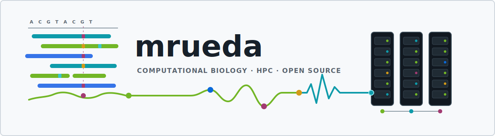
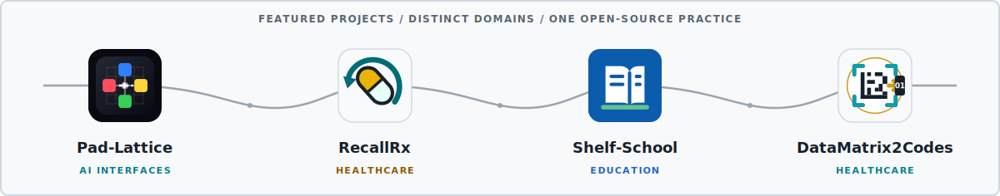

# Hi, I'm Manuel Rueda 👋

I am a computational biologist based in Barcelona. I build open-source
scientific software for biomedical data interoperability, reproducible
genomics, and AI-assisted research.

I lead the
[CNAG Biomedical Informatics](https://github.com/CNAG-Biomedical-Informatics)
subteam, where we develop open-source infrastructure for biomedical data
and reproducible analysis. My independent projects apply the same engineering
approach to practical problems in healthcare, education, and human-computer
interaction.

## 🧬 Research software

My scientific work spans structural computational biology, genomics, and
biomedical informatics, with a current focus on biomedical data standards,
reproducible analysis workflows, and sustainable software infrastructure.

- 🧬 [**CBIcall**](https://github.com/CNAG-Biomedical-Informatics/cbicall)
  *(Genomics)* - A configuration-driven framework for reproducible variant
  calling in large sequencing cohorts.
- 🧩 [**ClarID Tools**](https://github.com/CNAG-Biomedical-Informatics/clarid-tools)
  *(Biomedical data)* - Tools for human-readable, compact identifiers in
  biomedical metadata integration.

Further collaborative projects are available through
[CNAG Biomedical Informatics](https://github.com/CNAG-Biomedical-Informatics).

## 🚀 Independent open-source projects

- 🎛️ [**Pad-Lattice**](https://github.com/mrueda/pad-lattice)
  *(AI interfaces)* - A tactile visual language between people and AI agents,
  available through physical MIDI pad controllers and virtual surfaces on
  phones, tablets, and browsers.
- 💊 [**RecallRx**](https://github.com/mrueda/recallrx) *(Healthcare)* -
  Country-aware medicine recall search using official regulatory sources.
- 📚 [**Shelf-School**](https://github.com/mrueda/shelf-school) *(Education)* -
  A self-hosted library management system for small schools.
- 💊 [**DataMatrix2Codes**](https://github.com/mrueda/datamatrix2codes)
  *(Healthcare)* - Decode and process GS1 DataMatrix barcodes used on
  pharmaceutical packaging.

### 🧪 Experiments

- 🎵 [**Music Key Detector**](https://github.com/mrueda/music-key-detector)
  *(Audio analysis)* - A compact experiment for estimating likely major or
  minor keys, with confidence and ambiguity reporting.

## 💾 Background

I began programming in [BASIC](https://en.wikipedia.org/wiki/BASIC) on an
[MSX](https://en.wikipedia.org/wiki/MSX) and have continued building software
throughout my scientific career. My background as a musician informed
Pad-Lattice's use of MIDI grid controllers as interfaces for AI agents.

Older repositories are preserved as part of my professional journey. Projects
that are no longer maintained are archived rather than removed.
