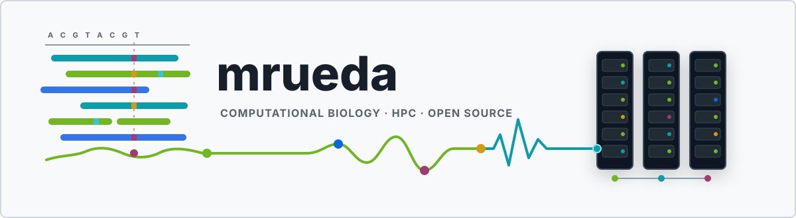

# Manuel Rueda 👋

I am a computational biologist based in Barcelona. I build open-source
scientific software for biomedical data interoperability, reproducible
genomics, and AI-assisted research.

I lead the
[CNAG Biomedical Informatics](https://github.com/CNAG-Biomedical-Informatics)
subteam, where we develop open-source infrastructure for biomedical data
and reproducible analysis. I also develop independent software for healthcare,
education, and human-computer interaction.

## 🧬 Research software at CNAG

My research spans structural computational biology, genomics, and biomedical
informatics. Selected collaborative projects include:

- 🧩 [**Convert-Pheno**](https://github.com/CNAG-Biomedical-Informatics/convert-pheno)
  *(Biomedical data)* - A toolkit for converting phenotypic data between
  standard data models.
- 🧬 [**CBIcall**](https://github.com/CNAG-Biomedical-Informatics/cbicall)
  *(Genomics)* - A configuration-driven framework for reproducible variant
  calling in large sequencing cohorts.

Further collaborative projects are available through
[CNAG Biomedical Informatics](https://github.com/CNAG-Biomedical-Informatics).

## 🚀 Independent open-source projects

| Area | Project | Description |
| --- | --- | --- |
| 🧬 Research | [**Digital Genome Workstation (DGW)**](https://github.com/mrueda/digital-genome-workstation) | Interactive and non-destructive editing of genome variants. |
| 🎛️ AI interfaces | [**Pad-Lattice**](https://github.com/mrueda/pad-lattice) | Physical and virtual interfaces for monitoring and controlling AI agents. |
| 💊 Healthcare & pharmacy | [**RecallRx**](https://github.com/mrueda/recallrx) | Country-aware medicine recall search using official regulatory sources. |
| 💊 Healthcare & pharmacy | [**Nomenclator Delta**](https://mrueda.github.io/nomenclator-delta/) | Search and compare monthly changes in Spain's official pharmaceutical Nomenclátor. |
| 💊 Healthcare & pharmacy | [**DataMatrix2Codes**](https://github.com/mrueda/datamatrix2codes) | Decode and process GS1 DataMatrix barcodes used on pharmaceutical packaging. |
| 📚 Education | [**Shelf-School**](https://github.com/mrueda/shelf-school) | A self-hosted library management system for small schools. |
| 📚 Education | [**Montessori Virtual Room**](https://github.com/mrueda/montessori-virtual-room) | Explore Montessori materials and activities in an interactive virtual classroom. |

### 🧪 Experiments

- 🎵 [**Music Key Detector**](https://github.com/mrueda/music-key-detector)
  *(Audio analysis)* - A compact experiment for estimating likely major or
  minor keys, with confidence and ambiguity reporting.

## 💾 Background

I began programming in [BASIC](https://en.wikipedia.org/wiki/BASIC) on an
[MSX](https://en.wikipedia.org/wiki/MSX) and have continued building software
throughout my scientific career. My background as a musician informed
Pad-Lattice's use of MIDI grid controllers as interfaces for AI agents.
